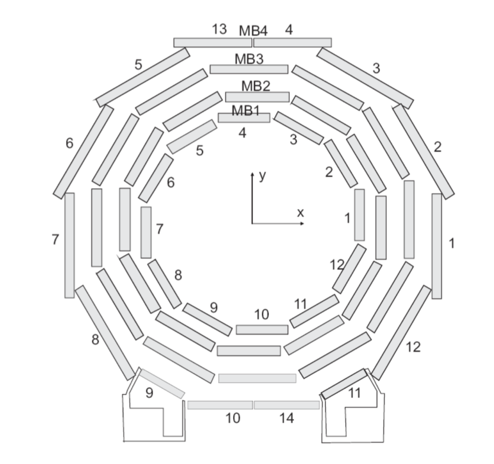

# Machine Learning project on muons from the CMS experiment at CERN

This project is based on data coming from **simulations** of particles colliding at the LHC (Large Hadron Collider) accelerator at CERN, in Geneva. In particular, the detection of a specific particle called muon (μ), in one of the four main experiments around LHC, the CMS experiment.



The data consists of muon tracks hitting the CMS muon chambers, shown in the image above. Such chambers are located in the outermost region of the detector, and consists of: 
- Four stations (from the inside out, named MBx);
- 12 sectors (covering the entire angular region of the detector), creating a wheel;
- 5 wheels, located side by side.

When a muon track hits the muon chambers, some of them are "activated" and produce a signal which is stored in the final data. 

The main purpose of this project is the application of Machine Learning algorithms, using data coming from simulated muon tracks, for the *prediction* of a specific kinematic physical variable, called *transverse momentum* ($p_T$).

## List of variables used for input

This section shows the input variables used in the csv:

```
dtPrimitive.id_r      Station identifier integer.
dtPrimitive.id_phi    Sector identifier integer.
dtPrimitive.id_eta    Ring/wheel identifier integer.
dtPrimitive.phiGlb    Phi angle expressed in global coordinates (depending on the active sector)
dtPrimitive.phiB      Bending angle (rescaled using: phiGlb+phiB/512)
genParticle.pt        Transverse momentum of the simulated muon (used as target for predictions).

```

## Python script from ROOT file to flat CSV
The simulated collisions are produced using a specific framework for High Energy Physics, called ROOT (https://root.cern).

The following script allows the user to convert the ROOT file in a flat csv for Machine Learning studies. 
**This step, however, is not required since the output csv have already been produced.**

How to use the conversion macro:
```
./ROOTtoCSV.py --help
Usage: PROG [-h] [--fin INPUTFILE] [--branch BRANCH] [--branches BRANCHES]
            [--fout FOUT] [--branch-list] [--cut CUT]

optional arguments:
  -h, --help           show this help message and exit
  --fin INPUTFILE      Input ROOT file
  --branch BRANCH      Input ROOT file branch (default events)
  --branches BRANCHES  ROOT branches to read,
                       e.g.'dtPrimitives.id_r,genParticles.pt'
  --fout FOUT          Output CSV file
  --branch-list        List branches and exit (requires --branch argument)
  --cut CUT            Cuts for CSV

```
Example:

```bash
./ROOTtoCSV.py --fin ./output/MuonTree.root --branch MuonPogTree/MUONPOGTREE --branches "dtPrimitive.id_r,dtPrimitive.id_eta,dtPrimitive.id_phi,dtPrimitive.bxTrackFinder(),dtPrimitive.phiGlb(),genParticle.pt,dtPrimitive.bx" --fout ./output/output_bxcut.csv --cut "dtPrimitive.bx==0"
```

The cut used for the creation of the CSV is:
```
dtPrimitive.bx==0    Bunch-Crossing required to be =0 in order to avoid all issues related to pile-up
```

## Content of the repo

The folder **Jupyter Notebooks** contains a list of the notebooks used for the Muon Trigger ML project. 

It contains three different notebooks:

 - A pre-process notebook for data preparation (1-Csv_processing.ipynb); 
 - The Keras model notebook for the model training and test (2-Keras_Model.ipynb);
 - Final plots using a physics framework called ROOT (3-ROOT_Plots.ipynb).
 
An additional jupyter is provided, with the study of different otger regression models using sklearn (csv_regression_models.ipynb).
 
The **output** folder, instead, contains the csv and ROOT data files as well as the keras trained models. 

